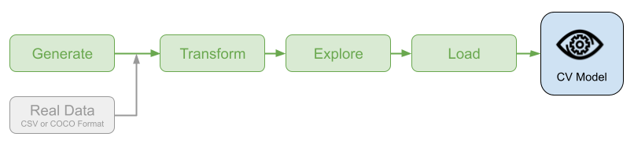

# SquiDS


[](https://github.com/mmgalushka/squids/actions)
[](https://codecov.io/gh/mmgalushka/squids)
[](https://www.codacy.com/gh/mmgalushka/squids/dashboard?utm_source=github.com&amp;utm_medium=referral&amp;utm_content=mmgalushka/squids&amp;utm_campaign=Badge_Grade)
[](https://github.com/psf/black)


[](https://mmgalushka.github.io/squids/)
[](https://github.com/mmgalushka/squids/blob/main/LICENSE)

The main goal of this project is to help data scientists working with Computer Vision (CV) domain better manage synthetic and real training data. This project will be useful in building machine learning (ML) models for:

- objects classification;
- objects detection/localisation;
- objects segmentation.

## Installation

To install SquiDS, run the following command from the command line:

```bash
~$ pip install squids
```

## Why use it?

If you are working in the computer vision domain, you may encounter situations when you are spending more time preparing data rather than creating, training, and testing models. The developed SquiDS package is intended to minimize the data preparation process so you can focus on the task which is matter.

SquiDS delivers four key capabilities



- **Generate** synthetic dataset in CSV and COCO formats;
- **Transform** dataset in either format to TFRecords;
- **Explore** content of generated TFRecords;
- **Load** TFRecords for machine learning model training and testing.

Also if the real data is stored in the compliant CSV or COCO format, it can be transformed, explored, and loaded using this SquiDS package.

## Usage

Import SquiDS library.

```Python
import squids as sds
```

Generate synthetic dataset in CSV format (by default, data are stored in the `dataset/synthetic` directory).

```Python
sds.create_dataset()
```

Transform dataset to TFRecords (by default, TFRecords are stored in the `dataset/synthetic-tfrecords` directory).

```Python
sds.create_tfrecords()
```

Explore generated TFRecords for model training (located at the `dataset/synthetic-tfrecords/instances_train` directory).

```Python
sds.explore_tfrecords("dataset/synthetic-tfrecords/instances_train")
```

```text
dataset/synthetic-tfrecords/instances_train
725 {1}        921 {1}        485 {1, 3}     686 {1, 2}     166 {1}
726 {2}        922 {1, 2, 3}  486 {3}        687 {1}        167 {3}
727 {3}        923 {2}        488 {1, 2}     688 {1, 3}     168 {1}
728 {2, 3}     924 {2}        489 {2, 3}     689 {1, 2}     169 {2}
729 {1, 2}     925 {3}        490 {2, 3}     690 {1, 3}     172 {1}
730 {3}        926 {2, 3}     491 {3}        692 {2}        173 {1, 3}
...            ...            ...            ...            ...
Total 712 records
```

The output shows the total number of records, a list of images IDs combined with annotated categories. For example, the following line `922 {1,2,3}` indicates that the image with ID `922` has one or more objects of the category `1`, one or more objects of the category `2`, and one or more objects of the category `3` respectively.

Explore a content of a TFRecord record with the image ID `922`.

```Python
sds.explore_tfrecords(
    "dataset/synthetic-tfrecords/instances_train",
    922,
    with_categories=True,
    with_bboxes=True,
    with_segmentations=True
)
```

```text
Property              Value
--------------------  ----------
image_id              922
image_size            (256, 256)
number_of_objects     3
available_categories  {1, 2, 3}
Image saved to ./922.png
```

The output contains information about image ID, its size, number of annotated objects, and their categories. Also, all information about bounding boxes, segmentation, and categories are overlaid to an image (stored in the `922.png` file).


Load TFRecords for model training and validation.

```Python
ds_train, train_steps_per_epoch = sds.load_tfrecords(
    "dataset/synthetic-tfrecords/instances_train", 
    output_schema = "C"
)

ds_val, val_steps_per_epoch = sds.load_tfrecords(
    "dataset/synthetic-tfrecords/instances_val", 
    output_schema = "C"
)
```

Note, the `output_schema="C"` argument instructs the data generator to return one-hot categories encoding.

Run the model training.

```Python
model = ...
model.compile(...)

model.fit(
    ds_train,
    steps_per_epoch = train_steps_per_epoch,
    validation_data=ds_val,
    validation_steps = val_steps_per_epoch,
    ...
)
```

For more information please read the [documentation](https://mmgalushka.github.io/squids/).

## Contributing

For information on how to set up a development environment and how to make a contribution to SquiDS, see the [contributing guidelines](CONTRIBUTING.md).

## Links

- PyPI Releases: [https://pypi.org/project/squids/](https://pypi.org/project/squids/)
- Source Code: [https://github.com/mmgalushka/squids](https://github.com/mmgalushka/squids/)
- Documentation: [https://mmgalushka.github.io/squids/](https://mmgalushka.github.io/squids/)
- Issue Tracker: [https://github.com/mmgalushka/squids/issues](https://github.com/mmgalushka/squids/)
