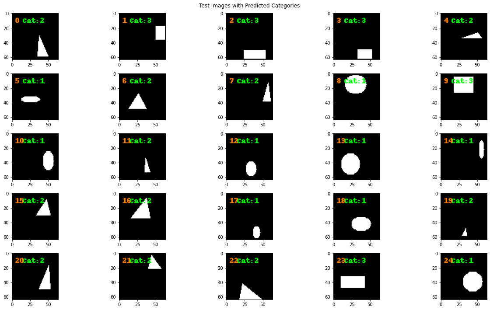
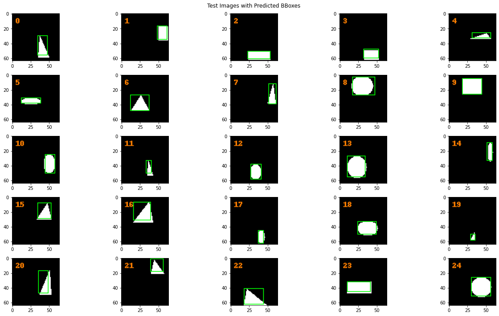
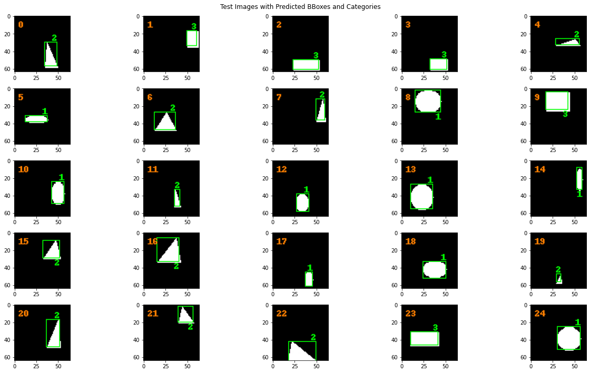
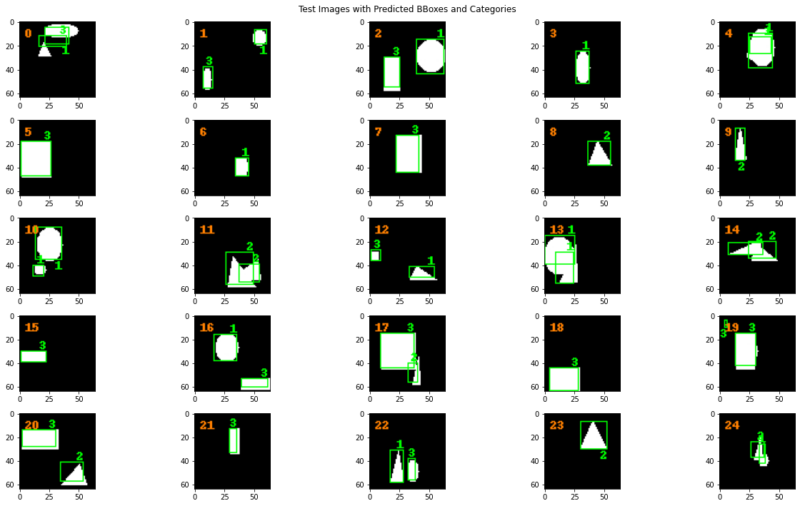

# Example of Using SquiDS Package

Install necessary packages for running examples.

```Bash
pip3 install tensorflow
pip3 install Pillow
pip3 install numpy
pip3 install hungarian-loss
pip3 install matplotlib
```

Import of necessary SquiDS functions and supporting packages for running the following examples.

```Python
from PIL import ImageDraw, ImageFont
import tensorflow as tf
import numpy as np

from squids import (
    create_dataset,
    create_tfrecords,
    explore_tfrecords,
    load_tfrecords,
    preprocess_image,
    Palette,
    Background
)
```

!!! Important
    The `hungarian-loss` is necessary for training a multi-objects detection model. It allows computing optimal assignment between predicted and ground truth entities.

Introduce the following function to simplify the process of visualizing model inference results.

```Python
import matplotlib.pyplot as plt


def plot_images(images, title=None):
    assert (
        len(images) == 25
    ), "Invalid number of plotting images, it must be 25"
    fig, ax = plt.subplots(5, 5)
    fig.set_size_inches(18, 10)
    sample = 0
    for i in range(5):
        for j in range(5):
            ax[i, j].imshow(images[sample])
            sample += 1
    if title is not None:
        fig.suptitle(title)
    plt.tight_layout()
```

<!--
Tabs:
    Object Classification |
    Object Localisation |
    Object Detection |
    Multi-objects Detection
-->

=== "Object Classification"
    [Generates](generator.md) 10k synthetic images with annotations and [transforms](transformer.md) them to the [TFRecords](https://www.tensorflow.org/tutorials/load_data/tfrecord). All generated images have the binary profile: "white geometrical shape on the black background".

    ```Python
    create_dataset(
        dataset_size=10000,
        image_palette=Palette.BINARY,
        image_background=Background.BLACK,
        random_state=365,
        image_capacity=1,
        verbose=True)
    create_tfrecords(verbose=True)
    ```

    !!! Important
        `image_capacity=1` indicates that generated only one random shape per image.

    Create [data generators](loader.md) and compute steps per epoch for model training and validation. 
 
    ```Python
    ds_train, train_steps_per_epoch = load_tfrecords(
        "dataset/synthetic-tfrecords/instances_train", 
        output_schema="C",
        num_detecting_objects=1,
    )
    ds_val, val_steps_per_epoch = load_tfrecords(
        "dataset/synthetic-tfrecords/instances_val", 
        output_schema="C",
        num_detecting_objects=1,
    )
    ```

    !!! Important
        - `output schema="C"` indicates that the generator returns an object category (one-hot encoding);
        - `num_detecting_objects=1` indicates one object classification per image;

    Define object classification model.

    ```Python
    model = tf.keras.models.Sequential([
        tf.keras.layers.Conv2D(
                filters=32,
                kernel_size=(3, 3),
                padding='same',
                input_shape=(64, 64, 3)),
        tf.keras.layers.MaxPooling2D(
                pool_size=(2, 2)),
        tf.keras.layers.Flatten(),
        tf.keras.layers.Dense(
            1024, 
            kernel_initializer='random_normal',
            bias_initializer='zeros',
            activation='relu'),
        tf.keras.layers.Dense(4, activation='softmax')
    ])
    model.compile(
        optimizer=tf.keras.optimizers.Adam(),
        loss=tf.keras.losses.CategoricalCrossentropy(),
        metrics=tf.keras.metrics.CategoricalAccuracy()
    )
    ```

    Run the model training and validation.

    ```Python
    checkpoint_callback = tf.keras.callbacks.ModelCheckpoint(
        "best_weights.h5",
        monitor='val_loss',
        mode="min",
        save_best_only=True,
        verbose=1)
    model.fit(
        ds_train,
        steps_per_epoch = train_steps_per_epoch,
        epochs=10,
        validation_data=ds_val,
        validation_steps = val_steps_per_epoch,
        callbacks=checkpoint_callback,
        verbose=1
    )
    ```

    Using the data [explorer](explorer.md) to select 25 images from the test dataset.

    ```Python
    image_ids, _ = explore_tfrecords(
        'dataset/synthetic-tfrecords/instances_test',
        return_artifacts=True
    )

    images  = [
        explore_tfrecords(
            'dataset/synthetic-tfrecords/instances_test',
            image_id,
            return_artifacts=True
        )[0]
        for image_id in image_ids[0:25]
    ]
    ```

    Perform inference on selected test images.

    ```Python
    preprocessed_images = preprocess_image(
        np.array(
            [np.array(image) for image in images]
        ) / 255.0
    )

    model.load_weights("best_weights.h5")
    predictions = model.predict(preprocessed_images)
    ```

    Post-process the obtained predictions and overlay the result on the selected images.

    ```Python
    sample = 0
    for image, prediction in zip(images, predictions):
        draw = ImageDraw.Draw(image)

        category_id = np.argmax(prediction)

        draw.text(
            (15, 5),
            "Cat:" + str(category_id),
            "#00FF00",
            font=ImageFont.load_default(),
        )

        draw.text(
            (5,5),
            str(sample),
            "#FF8000",
            font=ImageFont.load_default(),
        )
        sample += 1

    plot_images(images, "Test Images with Predicted Categories")    
    ```

    

=== "Object Localisation"
    [Generates](generator.md) 10k synthetic images with annotations and [transforms](transformer.md) them to the [TFRecords](https://www.tensorflow.org/tutorials/load_data/tfrecord). All generated images have the binary profile: "white geometrical shape on the black background".

    ```Python
    create_dataset(
        dataset_size=10000,
        image_palette=Palette.BINARY,
        image_background=Background.BLACK,
        random_state=365,
        image_capacity=1,
        verbose=True)
    create_tfrecords(verbose=True)
    ```

    !!! Important
        `image_capacity=1` indicates that generated only one random shape per image.

    Create [data generators](loader.md) and compute steps per epoch for model training and validation. 
 
    ```Python
    ds_train, train_steps_per_epoch = load_tfrecords(
        "dataset/synthetic-tfrecords/instances_train", 
        output_schema="B",
        num_detecting_objects=1,
    )
    ds_val, val_steps_per_epoch = load_tfrecords(
        "dataset/synthetic-tfrecords/instances_val", 
        output_schema="B",
        num_detecting_objects=1,
    )
    ```

    !!! Important
        - `output schema="B"` indicates that the generator returns an object bounding box;
        - `num_detecting_objects=1` indicates one object localization per image;

    Define object localization model.

    ```Python
    model = tf.keras.models.Sequential([
        tf.keras.layers.Conv2D(
                filters=32,
                kernel_size=(3, 3),
                padding='same',
                input_shape=(64, 64, 3)),
        tf.keras.layers.MaxPooling2D(
                pool_size=(2, 2)),
        tf.keras.layers.Flatten(),
        tf.keras.layers.Dense(
            1024, 
            kernel_initializer='random_normal',
            bias_initializer='zeros',
            activation='relu'),
        tf.keras.layers.Dense(
            4,
            activation='relu')
    ])
    model.compile(
        optimizer=tf.keras.optimizers.Adam(),
        loss=tf.keras.losses.MeanAbsoluteError(),
    )
    ```

    Run the model training and validation.

    ```Python
    checkpoint_callback = tf.keras.callbacks.ModelCheckpoint(
        "best_weights.h5",
        monitor='val_loss',
        mode="min",
        save_best_only=True,
        verbose=1)
    model.fit(
        ds_train,
        steps_per_epoch = train_steps_per_epoch,
        epochs=10,
        validation_data=ds_val,
        validation_steps = val_steps_per_epoch,
        callbacks=checkpoint_callback,
        verbose=1
    )
    ```

    Using the data [explorer](explorer.md) to select 25 images from the test dataset.

    ```Python
    image_ids, _ = explore_tfrecords(
        'dataset/synthetic-tfrecords/instances_test',
        return_artifacts=True
    )

    images  = [
        explore_tfrecords(
            'dataset/synthetic-tfrecords/instances_test',
            image_id,
            return_artifacts=True
        )[0]
        for image_id in image_ids[0:25]
    ]
    ```

    Perform inference on selected test images.

    ```Python
    preprocessed_images = preprocess_image(
        np.array(
            [np.array(image) for image in images]
        ) / 255.0
    )

    model.load_weights("best_weights.h5")
    predictions = model.predict(preprocessed_images)
    ```

    Post-process the obtained predictions and overlay the result on the selected images.

    ```Python
    sample = 0
    for image, prediction in zip(images, predictions):
        draw = ImageDraw.Draw(image)
        bbox = prediction.astype(int)

        x, y, w, h = bbox
        draw.rectangle(
            (x, y, x + w, y + h),
            outline="#00FF00"
        )

        draw.text(
            (5,5),
            str(sample),
            "#FF8000",
            font=ImageFont.load_default(),
        )
        sample += 1

    plot_images(images, "Test Images with Predicted BBoxes")  
    ```

    

=== "Object Detection"
    [Generates](generator.md) 10k synthetic images with annotations and [transforms](transformer.md) them to the [TFRecords](https://www.tensorflow.org/tutorials/load_data/tfrecord). All generated images have the binary profile: "white geometrical shape on the black background".

    ```Python
    create_dataset(
        dataset_size=10000,
        image_palette=Palette.BINARY,
        image_background=Background.BLACK,
        random_state=365,
        image_capacity=1,
        verbose=True)
    create_tfrecords(verbose=True)
    ```

    !!! Important
        `image_capacity=1` indicates that generated only one random shape per image.

    Create [data generators](loader.md) and compute steps per epoch for model training and validation. 
 
    ```Python
    ds_train, train_steps_per_epoch = load_tfrecords(
        "dataset/synthetic-tfrecords/instances_train", 
        output_schema="BC",
        num_detecting_objects=1,
    )
    ds_val, val_steps_per_epoch = load_tfrecords(
        "dataset/synthetic-tfrecords/instances_val", 
        output_schema="BC",
        num_detecting_objects=1,
    )
    ```

    !!! Important
        - `output schema="BC"` indicates that the generator returns an object bounding box and category (one-hot encoding);
        - `num_detecting_objects=1` indicates one object detection per image;

    Define object detection model.

    ```Python
    localizer = tf.keras.models.Sequential([
        tf.keras.layers.Dense(
            1024, 
            kernel_initializer='random_normal',
            bias_initializer='zeros',
            activation='relu',
            input_shape=(1024,)),
        tf.keras.layers.Dense(
            4,
            activation='relu')
    ])

    classifier = tf.keras.models.Sequential([
        tf.keras.layers.Dense(
            1024, 
            kernel_initializer='random_normal',
            bias_initializer='zeros',
            activation='relu',
            input_shape=(1024,)),
        tf.keras.layers.Dense(
            4,
            activation='softmax'),
        tf.keras.layers.Lambda(lambda x: x * 10)
    ])

    common = tf.keras.models.Sequential([
        tf.keras.layers.Conv2D(
                filters=32,
                kernel_size=(3, 3),
                padding='same',
                input_shape=(64, 64, 3)),
        tf.keras.layers.MaxPooling2D(
                pool_size=(2, 2)),
        tf.keras.layers.Conv2D(
                filters=64,
                kernel_size=(3, 3),
                padding='same',
                input_shape=(64, 64, 3)),
        tf.keras.layers.MaxPooling2D(
                pool_size=(2, 2)),
        tf.keras.layers.Conv2D(
                filters=128,
                kernel_size=(3, 3),
                padding='same',
                input_shape=(64, 64, 3)),
        tf.keras.layers.MaxPooling2D(
                pool_size=(2, 2)),
        tf.keras.layers.Conv2D(
                filters=256,
                kernel_size=(3, 3),
                padding='same',
                input_shape=(64, 64, 3)),
        tf.keras.layers.MaxPooling2D(
                pool_size=(2, 2)),
        tf.keras.layers.Flatten(),
        tf.keras.layers.Dense(
            1024, 
            kernel_initializer='random_normal',
            bias_initializer='zeros',
            activation='relu'),
    ])

    model_input = common.input
    x = common(model_input)
    model_output = tf.keras.layers.Concatenate()(
        [localizer(x), classifier(x)])
    model = tf.keras.models.Model(model_input, model_output)
    model.compile(
        optimizer=tf.keras.optimizers.Adam(),
        loss=tf.keras.losses.mean_squared_error,
    )
    ```

    Run the model training and validation.

    ```Python
    checkpoint_callback = tf.keras.callbacks.ModelCheckpoint(
        "best_weights.h5",
        monitor='val_loss',
        mode="min",
        save_best_only=True,
        verbose=1)
    model.fit(
        ds_train,
        steps_per_epoch = train_steps_per_epoch,
        epochs=50,
        validation_data=ds_val,
        validation_steps = val_steps_per_epoch,
        callbacks=checkpoint_callback,
        verbose=1
    )
    ```

    Using the data [explorer](explorer.md) to select 25 images from the test dataset.

    ```Python
    image_ids, _ = explore_tfrecords(
        'dataset/synthetic-tfrecords/instances_test',
        return_artifacts=True
    )

    images  = [
        explore_tfrecords(
            'dataset/synthetic-tfrecords/instances_test',
            image_id,
            return_artifacts=True
        )[0]
        for image_id in image_ids[0:25]
    ]
    ```

    Perform inference on selected test images.

    ```Python
    preprocessed_images = preprocess_image(
        np.array(
            [np.array(image) for image in images]
        ) / 255.0
    )

    model.load_weights("best_weights.h5")
    predictions = model.predict(preprocessed_images)
    ```

    Post-process the obtained predictions and overlay the result on the selected images.

    ```Python
    sample = 0
    for image, prediction in zip(images, predictions):
        draw = ImageDraw.Draw(image)

        bbox = prediction[:4].astype(int)
        category_id = np.argmax(prediction[4:])
        if category_id > 0:
            x, y, w, h = bbox
            draw.rectangle(
                (x, y, x + w, y + h),
                outline="#00FF00"
            )
            if bbox[1] < 10:
                draw.text(
                    (x + w - 5, y + h),
                    str(category_id),
                    "#00FF00",
                    font=ImageFont.load_default(),
                )
            else:
                draw.text(
                    (x + w - 5, y - 10),
                    str(category_id),
                    "#00FF00",
                    font=ImageFont.load_default(),
                )
        draw.text(
            (5,5),
            str(sample),
            "#FF8000",
            font=ImageFont.load_default(),
        )
        sample += 1

    plot_images(images, "Test Images with Predicted BBoxes and Categories")
    ```

    

=== "Multi-objects Detection"
    [Generates](generator.md) 10k synthetic images with annotations and [transforms](transformer.md) them to the [TFRecords](https://www.tensorflow.org/tutorials/load_data/tfrecord). All generated images have the binary profile: "white geometrical shape on the black background".

    ```Python
    create_dataset(
        dataset_size=10000,
        image_palette=Palette.BINARY,
        image_background=Background.BLACK,
        random_state=365,
        image_capacity=2,
        verbose=True)
    create_tfrecords(verbose=True)
    ```

    !!! Important
        `image_capacity=2` indicates that generated one or two random shape(s) per image.

    Create [data generators](loader.md) and compute steps per epoch for model training and validation. 
 
    ```Python
    ds_train, train_steps_per_epoch = load_tfrecords(
        "dataset/synthetic-tfrecords/instances_train", 
        output_schema="BC",
        num_detecting_objects=2,
    )
    ds_val, val_steps_per_epoch = load_tfrecords(
        "dataset/synthetic-tfrecords/instances_val", 
        output_schema="BC",
        num_detecting_objects=2,
    )
    ```

    !!! Important
        - `output schema="BC"` indicates that the generator returns an object bounding box and category (one-hot encoding);
        - `num_detecting_objects=2` indicates one or two object detection(s) per image;

    Define multi-objects detection model.

    ```Python
    localizer = tf.keras.models.Sequential([
        tf.keras.layers.Dense(
            1024, 
            kernel_initializer='random_normal',
            bias_initializer='zeros',
            activation='relu',
            input_shape=(1024,)),
        tf.keras.layers.Dense(2 * 4),
        tf.keras.layers.Reshape((2, 4))
    ])

    classifier = tf.keras.models.Sequential([
        tf.keras.layers.Dense(
            1024, 
            kernel_initializer='random_normal',
            bias_initializer='zeros',
            activation='relu',
            input_shape=(1024,)),
        tf.keras.layers.Dense(2 * 4),
        tf.keras.layers.Reshape((2, 4)),
        tf.keras.layers.Softmax(),
        tf.keras.layers.Lambda(lambda x: x * 10)
    ])

    common = tf.keras.models.Sequential([
        tf.keras.layers.Conv2D(
                filters=32,
                kernel_size=(3, 3),
                padding='same',
                input_shape=(64, 64, 3)),
        tf.keras.layers.MaxPooling2D(
                pool_size=(2, 2)),
        tf.keras.layers.Conv2D(
                filters=64,
                kernel_size=(3, 3),
                padding='same',
                input_shape=(64, 64, 3)),
        tf.keras.layers.MaxPooling2D(
                pool_size=(2, 2)),
        tf.keras.layers.Conv2D(
                filters=128,
                kernel_size=(3, 3),
                padding='same',
                input_shape=(64, 64, 3)),
        tf.keras.layers.MaxPooling2D(
                pool_size=(2, 2)),
        tf.keras.layers.Conv2D(
                filters=256,
                kernel_size=(3, 3),
                padding='same',
                input_shape=(64, 64, 3)),
        tf.keras.layers.MaxPooling2D(
                pool_size=(2, 2)),
        tf.keras.layers.Flatten(),
        tf.keras.layers.Dense(
            1024, 
            kernel_initializer='random_normal',
            bias_initializer='zeros',
            activation='relu'),
    ])

    model_input = common.input
    x = common(model_input)
    model_output = tf.keras.layers.Concatenate()(
        [localizer(x), classifier(x)])
    model = tf.keras.models.Model(model_input, model_output)
    model.compile(
        optimizer=tf.keras.optimizers.Adam(),
        loss=hungarian_loss,
    )
    ```

    Run the model training and validation.

    ```Python
    checkpoint_callback = tf.keras.callbacks.ModelCheckpoint(
        "best_weights.h5",
        monitor='val_loss',
        mode="min",
        save_best_only=True,
        verbose=1)
    model.fit(
        ds_train,
        steps_per_epoch = train_steps_per_epoch,
        epochs=50,
        validation_data=ds_val,
        validation_steps = val_steps_per_epoch,
        callbacks=checkpoint_callback,
        verbose=1
    )
    ```

    Using the data [explorer](explorer.md) to select 25 images from the test dataset.

    ```Python
    image_ids, _ = explore_tfrecords(
        'dataset/synthetic-tfrecords/instances_test',
        return_artifacts=True
    )

    images  = [
        explore_tfrecords(
            'dataset/synthetic-tfrecords/instances_test',
            image_id,
            return_artifacts=True
        )[0]
        for image_id in image_ids[0:25]
    ]
    ```

    Perform inference on selected test images.

    ```Python
    preprocessed_images = preprocess_image(
        np.array(
            [np.array(image) for image in images]
        ) / 255.0
    )

    model.load_weights("best_weights.h5")
    predictions = model.predict(preprocessed_images)
    ```

    Post-process the obtained predictions and overlay the result on the selected images.

    ```Python
    sample = 0
    for image, prediction in zip(images, predictions):
        draw = ImageDraw.Draw(image)
        for detection in prediction:
            draw = ImageDraw.Draw(image)
            bbox = detection[:4].astype(int)
            category_id = np.argmax(detection[4:])
            if category_id > 0:
                x, y, w, h = bbox
                draw.rectangle(
                    (x, y, x + w, y + h),
                    outline="#00FF00"
                )
                if bbox[1] < 10:
                    draw.text(
                        (x + w - 5, y + h),
                        str(category_id),
                        "#00FF00",
                        font=ImageFont.load_default(),
                    )
                else:
                    draw.text(
                        (x + w - 5, y - 10),
                        str(category_id),
                        "#00FF00",
                        font=ImageFont.load_default(),
                    )
        draw.text(
            (5,5),
            str(sample),
            "#FF8000",
            font=ImageFont.load_default(),
        )
        sample += 1

    plot_images(images, "Test Images with Predicted BBoxes and Categories")
    ```

    
