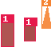

# Explore TFRecords

This process helps to explore a collection of TFRecords as well as each record individually. It can be initiated by the Python `explore_tfrecords(...)` function (see [PyDoc](#pydoc) for more information)  or via a command line.

## Usage

<!-- Usage tab (Python|Shell)  -->

=== "Python"
    ```py
    from squids import explore_tfrecords
    explore_tfrecords(...)

    ```

    !!! Note
        If the `image_id` argument is not defined this function generates a list with summaries for all TFRecords, otherwise, it generates a summary and reconstructs an image (with overlays for categories, bounding boxes, and masks) for the specified record.

        This function works in two modes. If the `return_artifacts` argument is `True`, this function returns the collected information. If it is `False`, the collected information is printed to the console and stored in the file (in the specified `output_dir`).
=== "Shell"
    ```shell
    ~$ python squids.main explore [-h] [--no-categories] [--no-bboxes] [--no-segmentations] TFRECORDS_DIR [IMAGE_ID] [OUTPUT_DIR]

    positional arguments:
        TFRECORDS_DIR       a TFRecords directory to explore

    optional arguments:
        -h, --help          show this help message and exit

    A record exploration options:
        IMAGE_ID            an image ID to select
        OUTPUT_DIR          an output directory to save rendered image
        --no-categories     turn off showing of categories
        --no-bboxes         turn off showing of bounding boxes
        --no-segmentations  turn off showing of segmentations
    ```
    !!! Note
        If the `IMAGE_ID` is not defined this command lists summaries for all TFRecords, otherwise it outputs the specified record summary and stores the reconstructed image (with overlays for categories, bounding boxes, and masks) to the `OUTPUT_DIR`.

## Outcome

### Exploring All Records

The result of using this command for exploring all TFRecords is shown below.

    ```text
    dataset/synthetic-tfrecords/instances_train (3 parts)
    732 (2)    865 (1)    370 (2)    524 (1,2)  664 (2)    82 (1)     237 (2)
    733 (1)    866 (1,2)  371 (1)    525 (2)    665 (1,2)  83 (2)     239 (1)
    734 (2)    871 (2)    372 (1)    526 (1,2)  666 (2)    84 (2)     240 (2)
    735 (1,2)  872 (2)    373 (1,2)  527 (1)    667 (2)    85 (2)     242 (2)
    736 (2)    874 (1)    378 (1,2)  528 (1)    668 (1,2)  88 (1)     245 (2)
    737 (2)    875 (2)    379 (2)    529 (1)    671 (2)    94 (2)     246 (1,2)
    738 (1,2)  876 (1,2)  381 (1)    530 (2)    673 (1)    95 (1)     247 (1)
    739 (1)    877 (2)    382 (1)    532 (1)    674 (1,2)  96 (1,2)   248 (1)
    742 (2)    878 (1)    383 (1,2)  533 (2)    675 (1)    97 (2)     250 (2)
    743 (2)    880 (2)    384 (1,2)  534 (1)    676 (2)    98 (1)     251 (2)
    744 (2)    881 (1,2)  385 (1,2)  537 (1,2)  677 (1,2)  99 (2)     252 (1)
    746 (2)    883 (1)    387 (1)    539 (2)    678 (1,2)  100 (1)    253 (2)
    747 (2)    884 (1)    388 (1,2)  540 (1,2)  679 (1,2)  101 (2)    255 (1,2)
    748 (1)    885 (1,2)  390 (1)    541 (1)    680 (1)    103 (2)    256 (1)
    750 (1)    886 (1)    392 (1)    543 (1,2)  681 (2)    104 (1,2)  257 (1)
    751 (1,2)  887 (2)    394 (2)    544 (1)    682 (1,2)  105 (1,2)  258 (2)
    752 (2)    888 (1)    395 (2)    545 (1,2)  685 (2)    106 (1)    259 (1)
    754 (1,2)  889 (1,2)  396 (1)    548 (1)    686 (1,2)  109 (1)    260 (2)
    755 (2)    891 (1)    398 (2)    549 (1)    688 (1)    110 (2)    261 (1,2)
    756 (1)    892 (1,2)  399 (1)    550 (1)    689 (1)    111 (2)    262 (1)
    757 (2)    896 (2)    400 (1,2)  551 (1)    690 (2)    112 (2)    263 (1,2)
    758 (2)    897 (1,2)  401 (1)    552 (1,2)  691 (1)    113 (1,2)  264 (2)
    759 (2)    899 (1)    403 (1)    553 (1)    692 (1,2)  116 (1,2)  265 (1)
    860 (1)    999 (2)    514 (1,2)  660 (2)    78 (2)     232 (1)
    861 (2)    365 (2)    516 (2)    661 (2)    79 (1,2)   233 (2)
    862 (1,2)  368 (2)    518 (2)    662 (1)    80 (2)     234 (2)
    863 (2)    369 (1)    523 (1,2)  663 (2)    81 (1,2)   235 (1,2)
    Total 715 records
    ```

From the output, you can observe the number of TFRecords parts, the total number of images contained with these records, the listing of all images IDs combined with indicators categories present for each image. For example, if we have the following line `123 (1,2)`, it means that the image with ID `123` has 1 or more objects of category `1` and 1 or more objects of category `2`. This should help you pick a specific image including a specific set of categories.

!!! Note
    If you use  function `explore_tfrecords` with `return_artifacts==True` it returns a list of record summaries such as `["732 (2)", "733 (1)", "734 (2)", "735 (1,2)", ...]`. You can apply your own style to its visualization.

### Exploring Individual Record

The individual record exploration produces the following output to the console and saves the image file `<image_id>.png` to the output directory.

    ```text
    Property                  Value
    ------------------------  -----------
    Image ID                  735
    Image Shape               (64, 64, 3)
    Total Labeled Objects     2
    Available Categories Set  {1, 2}
    Image saved to ./735.png
    ```

The output contains information about the image identifier its shape, number of annotated objects, and their categories. Also, all information about bounding boxes, segmentation, and categories are overlaid to the image, which example is shown below.



!!! Note
    If you use  function `explore_tfrecords` with `return_artifacts==True` it returns two arguments: the first is a dictionary with the record summaries such as `{"image_id": 757, "image_shape": "(64, 64, 3)", ...}` and the second is a PIL image with overlays of categories, bounding boxes and masks.

## PyDoc

::: squids.tfrecords.explorer
    selection:
      members:
        - explore_tfrecords
