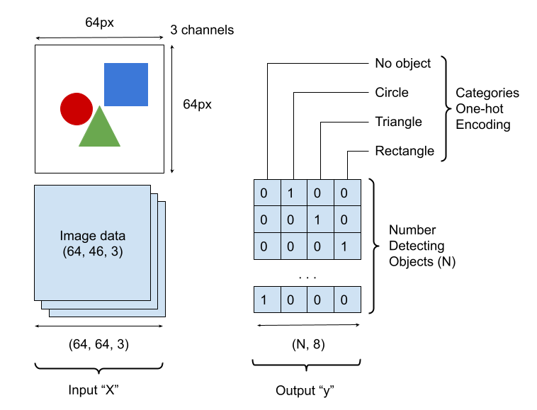
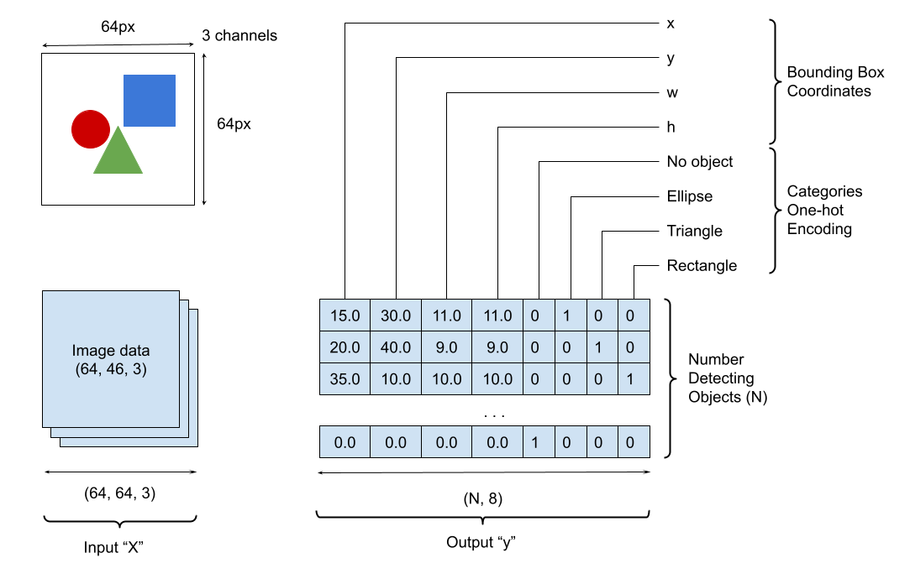
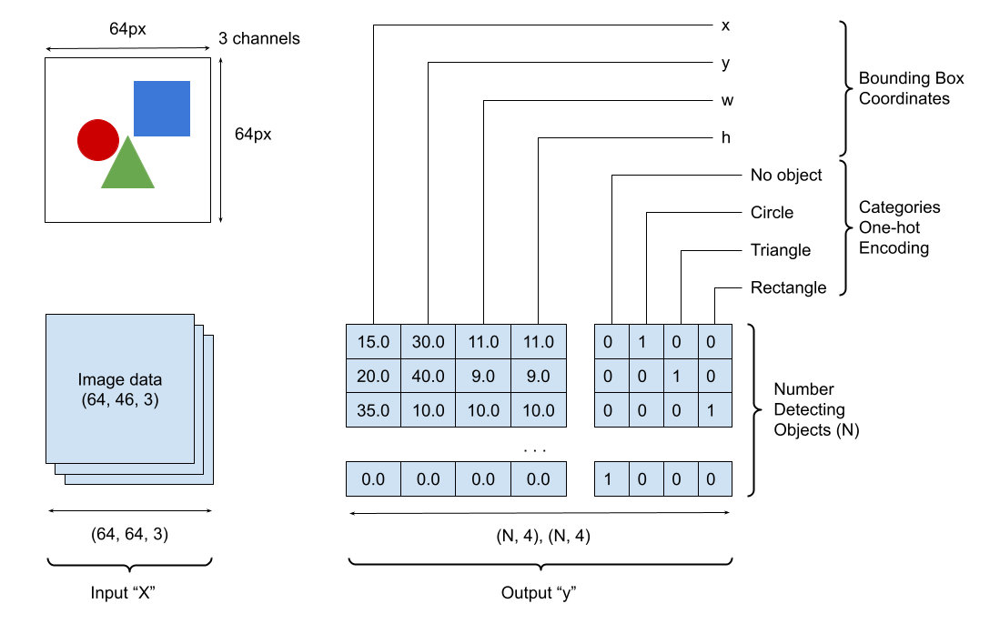
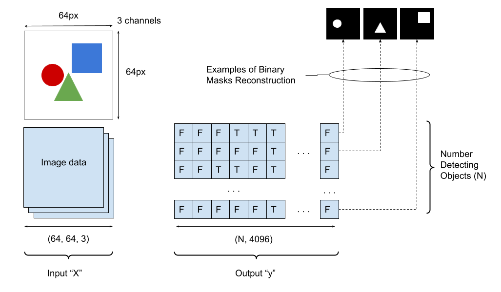
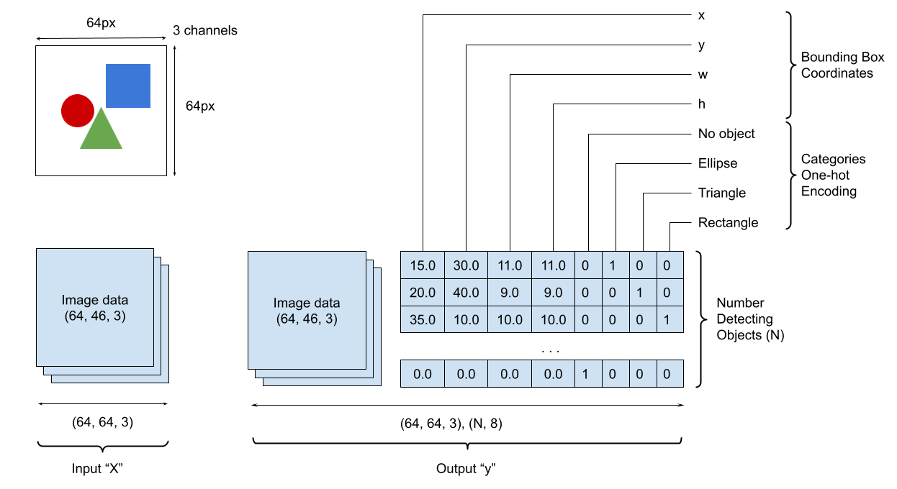

# Load TFRecords

The following instructions describe how to use the created TFRecords for model fitting and testing.

## Model Fitting

The typical usage of preparing training and validation data generators is shown below.

```py
from squids import load_tfrecords

train_generator, train_steps_per_epoch = load_tfrecords(
    "dataset/synthetic-tfrecords/instances_train",
    output_schema=...,
    num_detecting_objects=...
)
val_generator, val_steps_per_epoch = load_tfrecords(
    "dataset/synthetic-tfrecords/instances_val",
    output_schema=...
    num_detecting_objects=...
)

...
model.fit(
    train_generator,
    validation_data=val_generator, 
    steps_per_epoch=train_steps_per_epoch,
    validation_steps=val_steps_per_epoch,
    ...
)
...

```

The presented code creates two data generators one for the training cycle and another one for validation respectively. In addition `load_tfrecords` function (see [PyDoc](#pydoc) for more information)  computes the number of steps required to go through the whole dataset.

### Number of Detecting Objects

The number of detecting objects `num_detecting_objects` is probably a self-explanatory concept. It defines the maximum number of objects which a machine learning algorithm can detect within an image. It must greater than 0.

For instance, when fitting in a simple classification model predicting "Cat or Dog" in an image, set  `num_detecting_objects=1`. Assuming that the supplying data have just one object annotation per image.

!!! Important
    To ignore the number of detecting objects and retrieve the exact number of annotated objects, set this argument to `None`.

### Output Schema

The constructed data generator defines the model input data `X` as a 3D image array.  The model output data `y` are configurable via the function argument `output_schema`. The output schema is defined by a string that may contain a combination of the following characters:

| Character | Definition                         |
|-----------|------------------------------------|
| I         | "input" image data                 |
| C         | one-hot categories encoding        |
| B         | bounding boxes                     |
| M         | boolean masks                      |
| ,         | the flag to create separate output |

!!! Important
    Make sure that the output schema does not include any other symbols (including empty spaces) rather than the 5 characters listed in the above table.

#### Example of "C" Configuration

This is an example where a model designed to predict categories of shapes within an image.  The output schema is `"C"`. The character `C` indicates that this model output contains just categories one-hot encoding  `(N, 4)`, where `4` stands for 3 possible categories ("circle", "triangle", and "rectangle") plus "no object" category. See the image below for more details.



#### Example of "BC" Configuration

This is an example where a model designed to predict bounding boxes and categories of shapes within an image. The output schema is `"BC"`. The character `B` indicates that the model output contains bounding boxes and `C` - categories respectively. No comma between characters `B` and `C` indicates that bounding boxes and categories are concatenated for the one head `(N, 8)`. See the image below for more details.



#### Example of "B,C" Configuration

This is an example where a model is designed to predict bounding boxes and categories of shapes within an image. The output schema is `"B,C"`. The character `B` indicates that the model output contains bounding boxes and `C` - categories respectively. The comma between characters `B` and `C` indicates that bounding boxes and categories are supplied into two separate heads `(N, 4) (N, 4)`. See the image below for more details.



#### Example of "M" Configuration

This is an example where a model is designed to predict masks of shapes within an image.  The output schema is `"M"`. The character `M` indicates that this model output contains just image boolean masks   `(N, 4096)`, where `4096` stands for flattened masks of size `64x64`.  See the image below for more details.



#### Example of "I,BC" Configuration

This is an example where a model (of autoencoder) is designed to reconstruct an image and predict bounding boxes and categories of shapes within an image. The output schema is `"I,BC"`. The character `I` indicates that one model output contains image (identical to the input one),  `B` - bounding boxes, and `C` - categories respectively. The comma between characters `I` and `BC` indicates that the image is supplied to the one head and bounding boxes together with categories are supplied to another heads `(N, 4) (N, 4)` accordingly. See the image below for more details.



## PyDoc

::: squids.tfrecords.loader
    selection:
      members:
        - load_tfrecords
